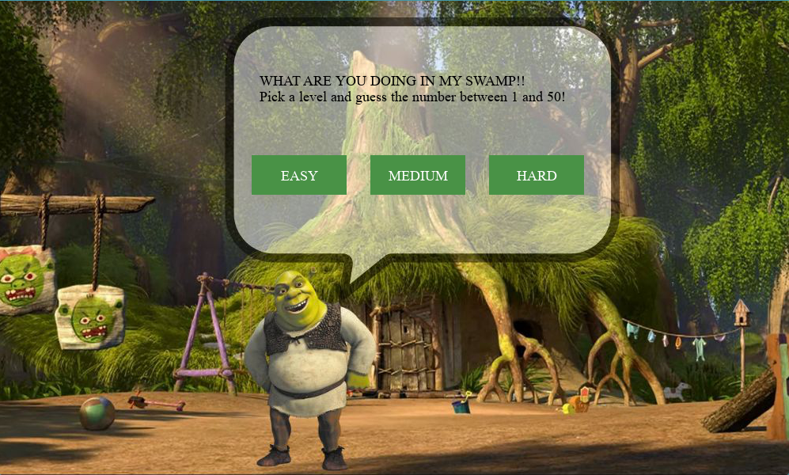
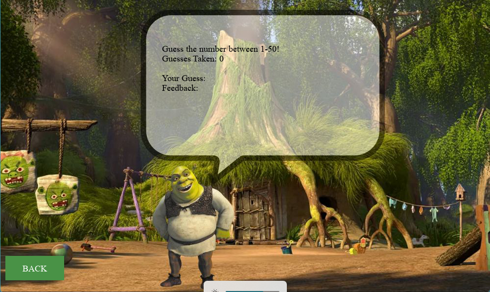
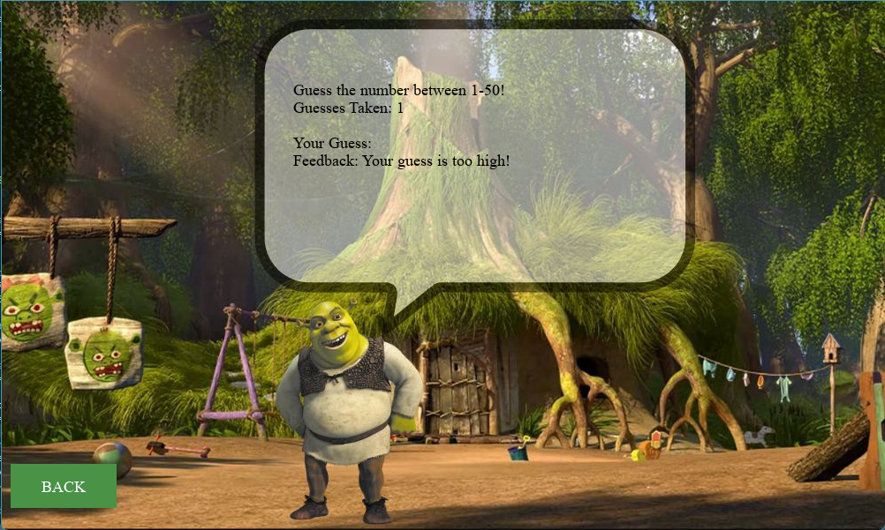
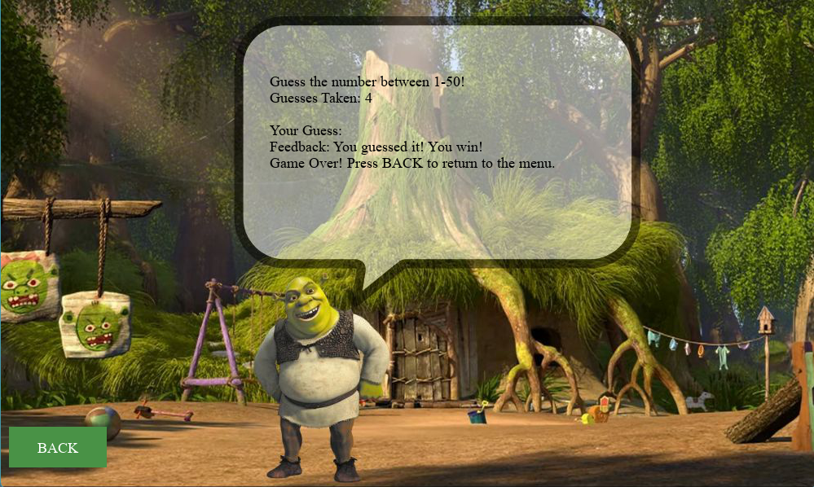
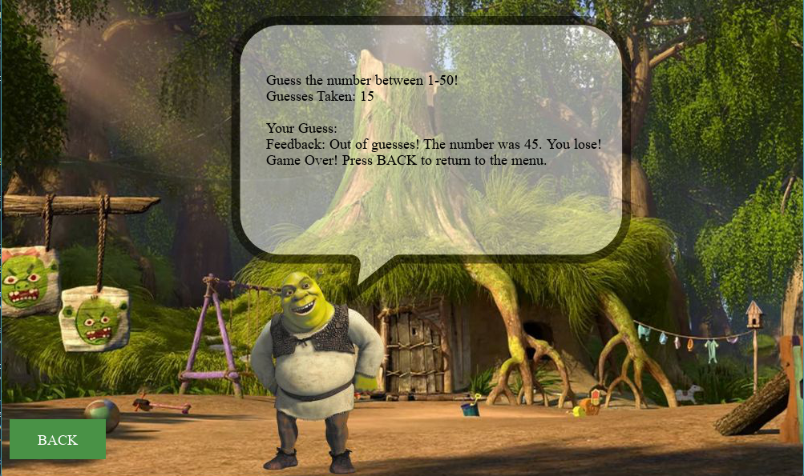

# Guess Shrek's Number

## Overview

"Guess Shrek's Number" is a Shrek-themed twist on the classic "Guess the Number" game. Developed as a final project for my CHE120 class, this game allowed me to creatively apply and extend my Python skills, particularly using Pygame.  

This project involved:  
- Transforming a command-line version of "Guess the Number" into a **graphical user interface (GUI)** game. 
- Incorporating **Shrek-inspired visuals** for an engaging user experience.  
- Using Python programming concepts such as **loops**, **functions**, and **event handling**.

# Shrek-Themed Guess The Number Game

This game is a Shrek-themed take on the classic "Guess the Number" game. It features:
- **Graphics**: Shrek-inspired visuals.
- **Game Logic**: Python code to manage gameplay and events.
- **GUI**: Built with Pygame for buttons and text updates.

## Game Rules
1. Select a difficulty level by clicking one of the boxes. For each level, you are given a different
amount of guesses:
- Easy: 15 guesses
- Medium: 10 guesses
- Hard: 5 guesses
2. Guess the number between 1 and 50 that Shrek is thinking of. If guessed incorrectly, you will be eaten by Shrek!

## Gameplay Screenshots
## Gameplay Screenshots

## How to Run
1. Install Python 3 and Pygame.
2. Run `src/main.py`.

## Directory Structure
- `ASSETS/`: Contains the background image (game media).
- `GAMEPLAY_IMAGES/`: Contains images of the game functionaility.
- `SRC/`: Contains the Python source code.
- `requirements.txt`: Python dependencies.

### Contributers
- Josephine Adeoni.
- Amariah Archibong
- Lily Dang.